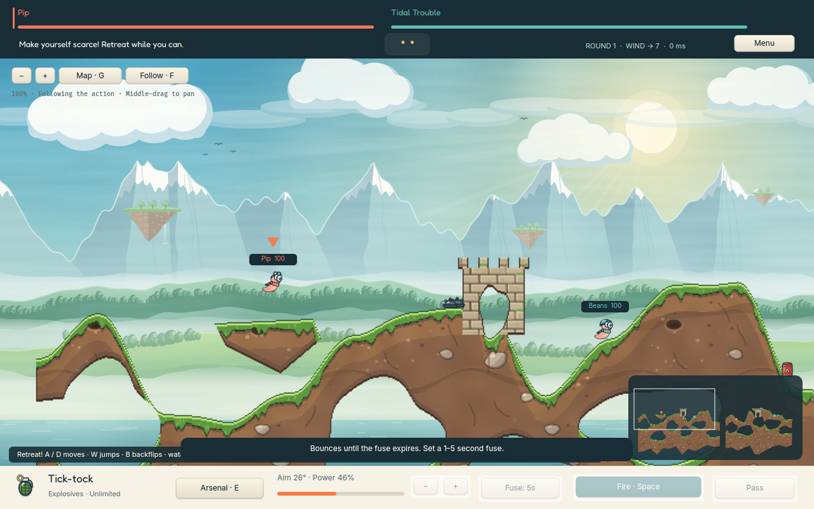

# scarpe-worms · Burrow Brigade

An original desktop artillery game built with [Scarpe](https://github.com/scarpe-team/scarpe)'s native renderer.
Up to six teams, destructible random maps, 48 weapons and tools, and self-hosted online play.



**Status: 0.3.0 preview.** The first distribution target is Apple silicon, macOS 13+.
Art, physics, and controls are still being refined. This is not yet a sales release.
See [current status and next work](docs/STATUS.md).

## Run from source

Install Ruby 3.4+, Bundler, Rust via rustup, Python 3.12+, and Git.
[Development setup](CONTRIBUTING.md) lists the platform dependencies.

```sh
git clone https://github.com/AliOsm/scarpe-worms.git
cd scarpe-worms
./setup.sh
./run.sh
```

Setup downloads pinned Scarpe source, applies the independent patches, installs
gems, and builds the native renderer. No sibling prototype repo is needed.

For a standalone Mac app, follow [macOS packaging](docs/MACOS.md).
App bundles and ZIPs are build artifacts, not files in the source checkout.

## Play

- **Quick battle:** play against bots or resume an unfinished local match.
- **Create a match:** choose seeds, terrain, biome, world size, rules, and ammunition.
- **Play with friends:** host a room, join a server, or paste an invite.

| Action | Control |
| --- | --- |
| Move / jump / backflip | A/D or arrows · W/Enter · B |
| Aim / fire | Mouse · hold/release Space for throws; tap for guns and tools |
| Arsenal / fuse / chat | E · 1–5 · T |
| Overview / follow / zoom | G · F · Q/R or mouse wheel |
| Pan / menu | Middle-drag or minimap · Escape |

The on-screen hint explains each weapon's stages. See the [weapon guide](docs/WEAPONS.md).
Hosts and clients must use **protocol 3** together.

## Host online

```sh
docker compose up -d --build
docker compose logs burrow
```

Share the reachable host, port **4388/TCP**, room code, and certificate fingerprint.
The host saves matches and supports reconnects. [Hosting](docs/HOSTING.md) covers
port forwarding, direct Ruby, systemd, TLS, and backups.

## Develop

```sh
bundle exec rake test
./bin/check-native
```

- [Contributing](CONTRIBUTING.md) — setup, focused checks, and changes to Scarpe.
- [Agent guide](AGENTS.md) — where to start and invariants to preserve.
- [Documentation index](docs/README.md) — architecture, art, validation, and release work.

MIT licensed; see [LICENSE](LICENSE) and [third-party notices](THIRD_PARTY.md).
Burrow Brigade is independent and contains no Team17 game assets or code.
